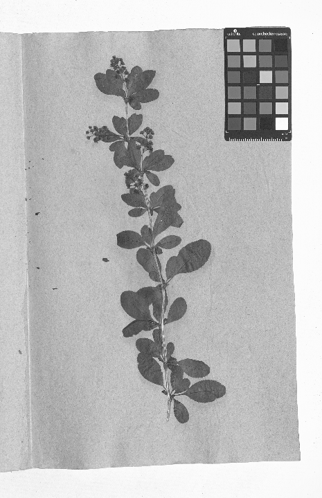
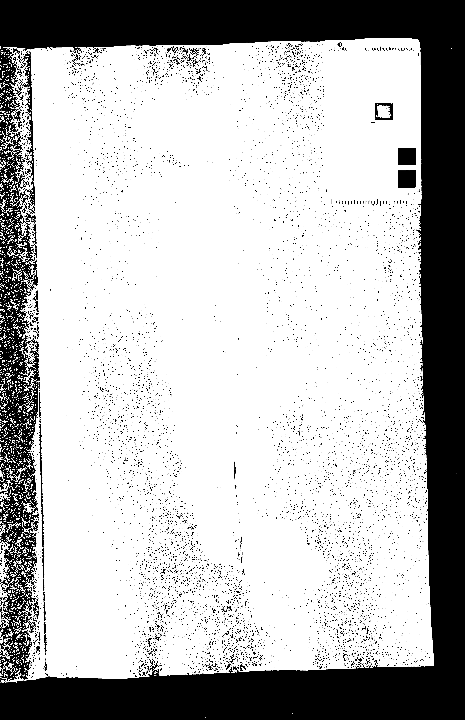
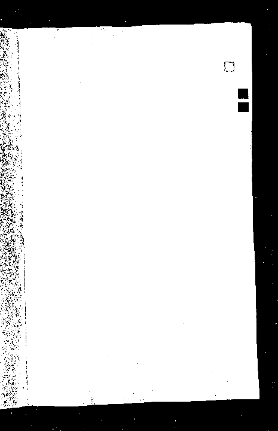

# Image Processing for Scan Correction

This project is designed to process scanned TIFF images to correct microrotations and other distortions using openCV for python.

The main assumptions of the algorithm are:

- The images are pages of a book scanned with a scanner that has a high resolution and a high quality.
- The pages are already aligned in the scanner (the microrotation should be less than 30 degrees).
- At least 3 of the 4 corners of the page are visible in the image.

The main entry point for the application is `main.py`, which utilizes various modules in the `src` directory to perform image processing tasks.

## Project Structure

- **main.py**: The main script to run the image processing pipeline. It handles command-line arguments and coordinates the processing of images.
- **edge_detection.py**: Contains the `process_tiff` function, which implements the full image processing pipeline, including loading, contour detection, warping, and saving images.
- **report.py**: Contains the `report` function, which generates a report of the processed images in order to identify malfunctions.
- **src/**: A directory containing various modules that perform specific image processing tasks:
  - **preprocess.py**: Prepares images by converting them to grayscale, blurring, and thresholding.
  - **transform.py**: Handles the warping of images to correct perspective distortions.
  - **spinner.py**: Provides a visual spinner to indicate processing progress.
  - **utils.py**: Utility functions for image display, loading, and saving.
  - **crop.py**: Contains functions to remove unwanted borders from images.

## Installation

To set up the project, ensure you have Python (I used Python 3.10.12) installed along with the necessary packages. You can install the required packages using:

```bash
pip install -r requirements.txt
```

## Usage

To process images, run the `main.py` script with the input and output directories specified:

```bash
python main.py <input_dir> <output_dir>
```

- `<input_dir>`: Directory containing the input TIFF files.
- `<output_dir>`: Directory where the processed images will be saved with the same name as the input files.

## Functionality

The primary goal of this project is to correct microrotations in scanned images. The processing pipeline includes:

1. **Loading Images**: Images are loaded from the specified input directory.
2. **Preprocessing**: Images are converted to grayscale, blurred, and thresholded to prepare for contour detection.
3. **Contour Detection**: The page contour is detected to identify the area of interest.
4. **Warping**: The image is warped to correct perspective distortions and microrotations.
5. **Saving Outputs**: The processed image and a thumbnail are saved to the specified output directory.

## How it Works

Let's see how it works with a test image:

### Step 1: Load and Convert to Grayscale


First, the image is loaded and converted to grayscale.



### Step 2: Blur and Threshold

Then, the image is blurred and thresholded to prepare for contour detection.



### Step 3: Dilate for Contour Visibility

The image is dilated to make the contour more visible.



### Step 4: Contour Detection

At this point, the image is ready for contour detection. We used the openCV function `findContours` to detect the contour.

The function takes the dilated image as input and returns the largest contour that resembles a page (which is basically a rectangle).

The function's parameters are:

- `cv2.RETR_EXTERNAL`: Only the outermost contours are detected.
- `cv2.CHAIN_APPROX_SIMPLE`: The contours are approximated to reduce the number of points.

The function returns the contours and the hierarchy. The hierarchy is not used in this project (we only need the largest contour).


You can find a detailed Python tutorial [here](https://medium.com/analytics-vidhya/opencv-findcontours-detailed-guide-692ee19eeb18#:~:text=To%20put%20in%20simple%20words,would%20be%20detected%20as%20contour.&text=The%20part%20that%20you%20want,above%20numbers%20in%201st%20image.).

### Step 5: Warp to Correct Distortions

Once the contour is detected, the image is warped to correct perspective distortions and microrotations based on the detected contour.


### Step 6: Remove Borders

A new problem arises: the image is now corrected in orientation, but the transformation generated a border around the image, so we need to remove it.

The algorithm that finds the black border has been invented for this project. It consists of:

1. Starting from the four corners of the image.
2. Moving in both side directions from the corner's pixel.
3. Finding the first non-black pixel in both directions.
4. Deciding which direction has a zone that is more likely to be the border to cut.

